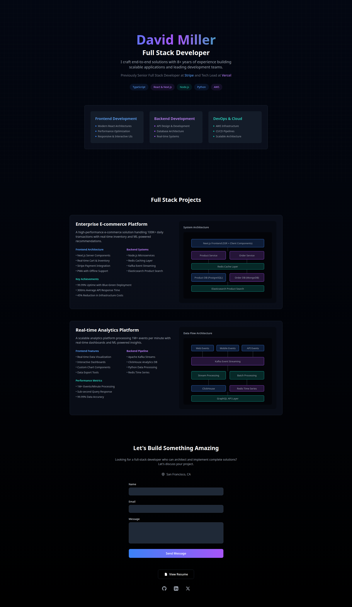

# Investigación

## ¿Qué es un portafolio de productos y cuál su propósito?

Un portafolio de productos es como una colección bien ordenada de los trabajos (proyectos, apps, diseños, sitios web, etc.) que has hecho, ya sea solo o en equipo. Su propósito es ser tu carta de presentación profesional. Es la mejor forma de mostrar, con cosas concretas, las habilidades y la experiencia que tienes, sobre todo si lo tuyo son áreas como el diseño, desarrollo de software o tecnología.

### ¿Por qué es importante tener un portafolio?

Es súper importante, porque es la manera de demostrar lo que sabes hacer y cómo trabajas. Te permite atraer más oportunidades laborales, clientes o colaboraciones. Al tenerlo online, además, mucha más gente conoce tu trabajo. Por otra partes, te permite mostrar tus logros y competencias de manera clara y visual. Los empleadores o clientes pueden evaluar fácilmente tu nivel técnico y tu creatividad.

En teoría, en un mercado con mucha competencia, el portafolio te destaca del resto. Te hace diferente, ayudando a crear tu marca personal, porque si está bien hecho, refuerza tu identidad profesional y te ayuda a posicionarte como conocedor de tu área.

Para que tu portafolio sea efectivo, puedes seguir estos tips:

- **Destacar los mejores proyectos**: No muestres todo lo que has hecho, solo los proyectos más relevantes y representativos para el objetivo de tu portafolio, y explícalos con detalle. Lo ideal es también mostrar el proceso de cómo lo hiciste y el resultado final.

- **Diséñalo limpio y fácil de navegar**: Usar un diseño profesional, ordenado y con una estructura lógica. La idea es que cualquiera pueda encontrar la info sin marearse.

- **Mantenerlo actualizado**: Un portafolio no es algo que se hace una vez y te olvidas de él. Tienes que actualizarlo siempre con las cosas nuevas que aprendes y los proyectos que terminas. Además, incluye info como las tecnologías que usaste y el impacto del proyecto.

## Análisis de ejemplos reales

### 1. Magda, compañera del bootcamp

https://magdaig.github.io/portafoliojs/index.html

Es muy atractivo visualmente, con colores vivos y un diseño moderno. La navegación es sencilla, con un menú claro en la parte superior que permite acceder fácilmente a las diferentes secciones del portafolio. La variedad de proyectos es buena, mostrando tanto trabajos personales como colaborativos, y cada proyecto incluye una descripción detallada de las tecnologías utilizadas y el proceso de desarrollo. Magda utilizó HTML, CSS y JavaScript para construir su portafolio, lo que demuestra sus habilidades técnicas.

### 2. Midudev

https://github.com/midudev

Básicamente, porque utiliza su cuenta de GitHub como un Hub para concentrar toda su presencia online. La organización es clara, con repositorios bien etiquetados y documentados, lo que facilita la navegación y comprensión de sus proyectos. La variedad de proyectos es amplia, abarcando desde aplicaciones web hasta tutoriales y recursos educativos, todos ellos de alta calidad y relevancia en el ámbito del desarrollo web. Midudev aprovecha al máximo las funcionalidades de GitHub, como los README.md detallados y las GitHub Pages para alojar demos de sus proyectos.

## Diseño de tu propio portafolio

Buscando templates que activen mi imaginación, me gustó este diseño:

## Exploración de herramientas para la construcción

¿Cómo me podrían ayudar las siguientes herramientas?

### GitHub Pages

Es ideal para desarrolladores porque permite alojar una página web estática directamente desde un repositorio de GitHub. Te permite mostrar tu código y estilo de programación. Se usa harto con archivos README.md bien detallados para explicar los proyectos.

### Un sitio web con HTML/CSS (Desarrollo propio)

Esto te da la máxima personalización para mostrar tu portafolio de forma súper profesional. Te permite mostrar no solo tus proyectos, sino también que manejas el código base (HTML, CSS, JavaScript). Si hasta ahora es lo mismo que el punto anterior, acá puedes usar frameworks como React o Next.js para hacerlo más dinámico y en Github Pages no.

### YouTube

Si tus proyectos son aplicaciones, diseños o cosas que se tienen que ver en acción, un canal de YouTube es un acierto. Puedes subir videos de demostración, tutoriales o casos de estudio explicando cómo funcionan tus proyectos. Luego, enlazas estos videos a tu portafolio principal. El camino a "Mediodev" esta ahí a un upload de distancia.

### ¿Cuál herramienta elegirías y por qué?

Yo elegiría una página web personal hecha con HTML/CSS/JavaScript (desarrollo propio) y lo complementaría con GitHub Pages.¿Por qué? El desarrollo propio me permite tener un diseño atractivo, limpio y completamente a mi pinta, lo que refuerza mi marca personal. Al hacerlo con código, demuestro que tengo la habilidad técnica desde la base. Además, si lo subo a GitHub Pages (o un hosting como Netlify/Vercel), mantengo el código fuente ordenado y disponible para que los reclutadores lo vean. Es la combinación perfecta entre presentación profesional y evidencia tangible de mis habilidades.

## Entrega y Reflexión

### Conclusión

El portafolio de productos digitales es mucho más que una simple galería de trabajos; es, de verdad, una herramienta estratégica en el desarrollo profesional. Es la forma más potente de demostrar lo que sabes hacer, permitiendo que potenciales empleadores o clientes vean *al toque* el nivel técnico, la creatividad y el proceso detrás de cada proyecto. En un mundo digital tan competitivo, un portafolio bien estructurado y actualizado te diferencia de los demás y te posiciona como un experto en tu área, reforzando tu marca personal. Las buenas prácticas, como seleccionar los mejores trabajos y mantener un diseño limpio, son fundamentales para que el portafolio sea efectivo y cumpla su objetivo: abrirte puertas y generar oportunidades. Tenerlo online en plataformas como GitHub pages o una web personal no solo te da visibilidad, sino que te exige estar en constante evolución, lo cual es vital para el crecimiento profesional.
